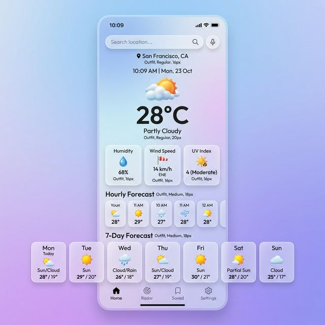

# World's Weather: A Comprehensive Cross-Platform Weather Application
A modern, feature-rich weather application that provides real-time updates and accurate forecasts across all platforms.

[](https://opensource.org/licenses/MIT)
[](https://angular.io/)
[](https://ionicframework.com/)
[](https://capacitorjs.com/)

## Project Description
**World's Weather** is a high-performance, cross-platform mobile application designed to provide users with precise, localized weather data at their fingertips. Built with a focus on visual elegance and data accuracy, the app bridges the gap between sophisticated weather analytics and a user-friendly interface.

### What the Application Does
- **Real-Time Data Integration**: Fetches live weather conditions by combining data from both OpenWeatherMap and WeatherAPI.com for maximum reliability.
- **Location-Aware Forecasts**: Automatically detects user location (using Capacitor Geolocation) to provide immediate weather updates.
- **Detailed Analytics**: Displays multi-day forecasts, humidity levels, wind speeds, UV indices, and astronomical data like sunrise/sunset times.
- **Cross-Platform Compatibility**: Deploys seamlessly to Android, iOS, and Web from a single codebase.

### Why These Technologies?
- **Angular (v17)**: Chosen for its robust architecture, powerful dependency injection, and efficient handling of complex state management.
- **Ionic Framework (v8)**: Provides a premium UI/UX library that ensures the app looks and feels native on both iOS and Android.
- **Capacitor (v7)**: Enables direct access to native device features (Geolocation, Haptics, Status Bar) through a unified JavaScript API.
- **Dual-API ForkJoin Strategy**: Utilizes RxJS `forkJoin` to simultaneously query multiple weather providers, ensuring that if one service is limited, the app still delivers comprehensive data.

### Challenges and Future Goals
One of the primary challenges was harmonizing two different weather data models into a single, cohesive UI. Future iterations will include:
- **Push Notifications**: Proactive alerts for severe weather conditions.
- **Interactive Weather Maps**: Integration with Leaflet or Mapbox for visual precipitation tracking.
- **Historical Trends**: Allowing users to compare current weather with historical averages.

---

## Table of Contents
- [1. Project's Title](#ints-weather-a-comprehensive-cross-platform-weather-application)
- [2. Project Description](#2-project-description)
- [4. How to Install and Run the Project](#4-how-to-install-and-run-the-project)
- [5. How to Use the Project](#5-how-to-use-the-project)
- [6. Include Credits](#6-include-credits)
- [7. Add a License](#7-add-a-license)

---

## How to Install and Run the Project
To get the development environment set up and running on your local machine, follow these steps:

### Prerequisites
- [Node.js](https://nodejs.org/) (LTS recommended)
- [Ionic CLI](https://ionicframework.com/docs/cli) (`npm install -g @ionic/cli`)
- [Angular CLI](https://angular.io/guide/setup-local) (`npm install -g @angular/cli`)

### Installation Steps
1. **Clone the repository:**
   ```bash
   git clone https://github.com/your-username/ints-weather-crossplatform-mobile-app.git
   cd ints-weather-crossplatform-mobile-app/weather_app
   ```
2. **Install dependencies:**
   ```bash
   npm install
   ```
3. **Synchronize Capacitor (for mobile):**
   ```bash
   npx cap sync
   ```

---

## How to Use the Project
### Running Logically
To run the project in a browser for rapid testing:
```bash
ionic serve
```
### Running on Mobile Devices
To run on Android or iOS:
```bash
# For Android
npx cap open android

# For iOS
npx cap open ios
```

### Visual Preview

*Modern, glassmorphic UI showcasing real-time weather stats.*

### API Credentials
The application requires API keys from the following providers:
- **OpenWeatherMap**: [Get free key here](https://openweathermap.org/api)
- **WeatherAPI.com**: [Get free key here](https://www.weatherapi.com/)

*Note: Currently, API keys are located in `src/app/service/weather-api.service.ts`. It is recommended to move these to environment variables for production.*

---

## Credits
This project was developed with the support of various resources:
- **Collaborators**: [Ijerson Lastimosa Ilalto](https://github.com/Ijerson) (Lead Developer)
- **Frameworks**: [Ionic Framework](https://ionicframework.com/), [Angular](https://angular.io/)
- **Data Providers**: [OpenWeatherMap](https://openweathermap.org/), [WeatherAPI.com](https://www.weatherapi.com/)
- **Icons**: [FontAwesome](https://fontawesome.com/), [Ionicons](https://ionic.io/ionicons)

---

## License
This project is licensed under the **MIT License**. For more information, please see the [LICENSE](LICENSE) file in the root directory.

---